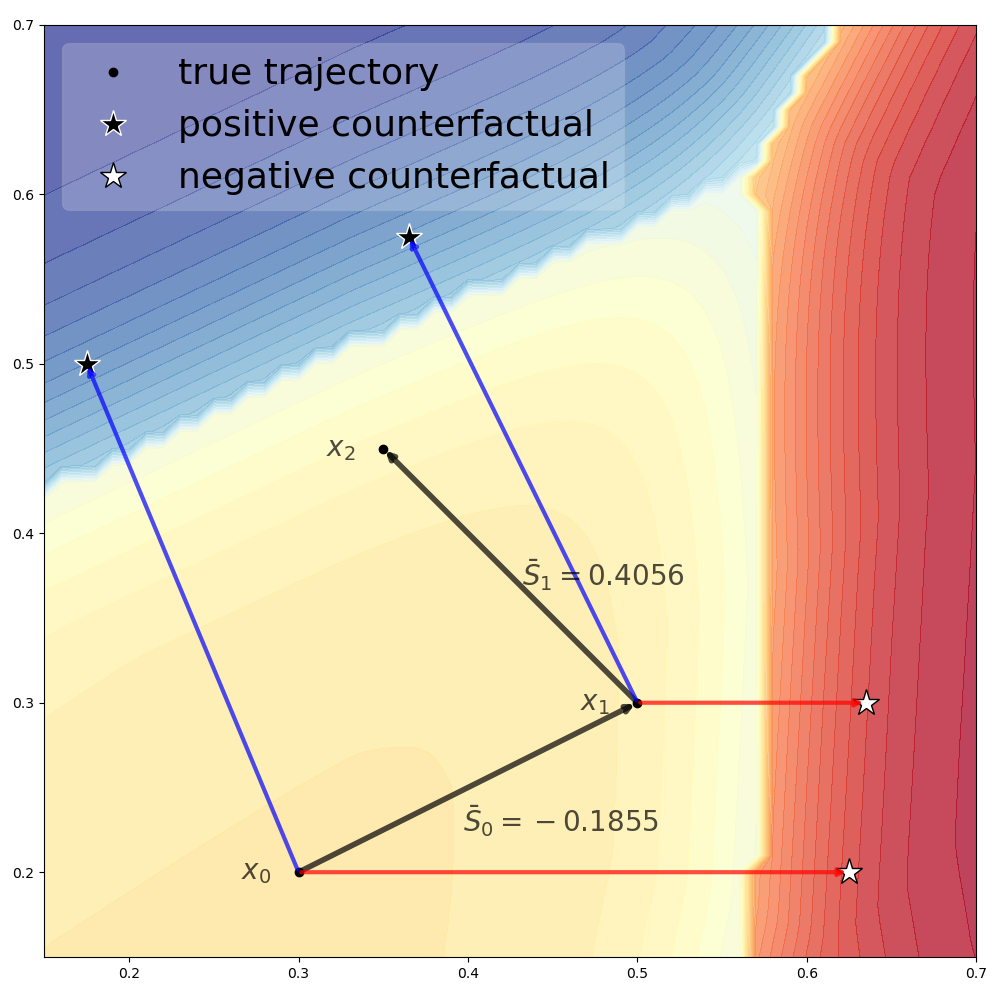

[](https://arxiv.org/abs/2309.15965)

To do:
[ ] List requirements
[ ] Create notebook example
[ ] Switch to Ed's updated TraCE plot

# TraCE: Trajectory Counterfactual Scores

This repository hosts source code, and implementation for case studies, for [`TraCE` as introduced at NLDL 2024](https://arxiv.org/abs/2309.15965).

## TLDR

Use TraCE scores to track progress in high-dimensionality multi-step processes down to an easily interpretable single score by measuring alignment in true trajectory against theoretical trajectories towards counterfactuals.

<p style="text-align:center">

</p>


## Abstract

Counterfactual explanations, and their associated algorithmic recourse, are typically leveraged to understand and explain predictions of individual instances coming from a black-box classifier. In this paper, we propose to extend the use of counterfactuals to evaluate progress in sequential decision making tasks. To this end, we introduce a model-agnostic modular framework, TraCE (Trajectory Counterfactual Explanation) scores, to distill and condense progress in highly complex scenarios into a single value. We demonstrate TraCE’s utility by showcasing its main properties in two case studies spanning healthcare and climate change.


## Requirments

* Numpy
* Scikit-learn...

Optionally: Your choice of counterfactual example generator. In the demo notebook we use DiCE but the `TraCE` framework can be applied to counterfactuals from a variety of sources, as described below.

## Intended use
TraCE is a model-agnostic framework which can be applied across domains and interfaced with existing tools. Alongside a series of factual datapoints, users are required to provide counterfactual reference point(s) to calculate TraCE scores against. These reference points can take several forms, including:

* Model-generated counterfactual explanations using any existing counterfactual generation method
* Predetermined landmarks, such as those guided by experts
* Corpus of historical values
* Input from other scientific studies

Users can provide single or multiple sets of counterfactual reference point(s).

In our paper we demonstrate different possible implementations of TraCE:
1. Hospital case study, utilising TraCE scores to track progress for patients in an intensive care unit. In this example we provide TraCE with both desirable (successfully discharged) and undersirable (in-hospital mortality) counterfactuals, determined from a corpus of known outcome labels from the training set.
2. Sustainable development case study, utilising TraCE scores to evaluate countries' historical development against established pathways. In this example we provide TraCE with expert-derived pathways to track alignment against.

## Citation
```
@article{clark2023trace,
  title={TraCE: Trajectory Counterfactual Explanation Scores},
  author={Clark, Jeffrey N and Small, Edward A and Keshtmand, Nawid and Wan, Michelle WL and Mayoral, Elena Fillola and Werner, Enrico and Bourdeaux, Christopher P and Santos-Rodriguez, Raul},
  journal={arXiv preprint arXiv:2309.15965},
  year={2023}
}
```
